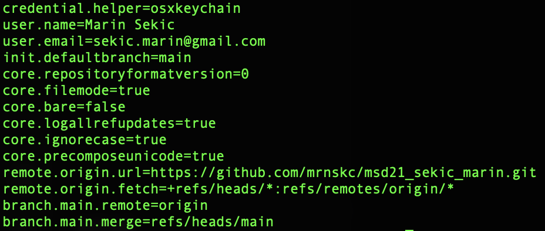
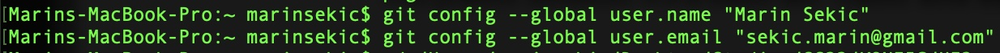
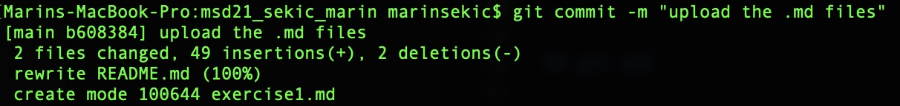
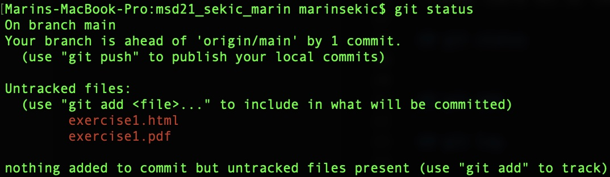
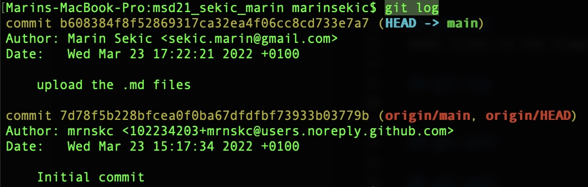

# Exercise 2

## git config
This command sets up different settings/configurations - here is a list (git config --list):\
[Image could not be loaded](media/git-config---list.png)

For this exercise we used the two following commands:\
\
It allows us to change the global user.name and user.email.

## git init
Creates a subdirectory in the respository.

## git commit
This command saves the current version of the project.\

## git status
Shows the current status of the working directory. Here we can see which changes are pending (staging area).\

## git add
Adds files to the staging area.

## git log
Shows a history of the changes of a respository.\

## git diff
Shows difference between commits or commit and working directory.

## git pull
Gets the current version of the online respository and updates the local directory.

## git push
Files from the local directory are sent to the online respository.